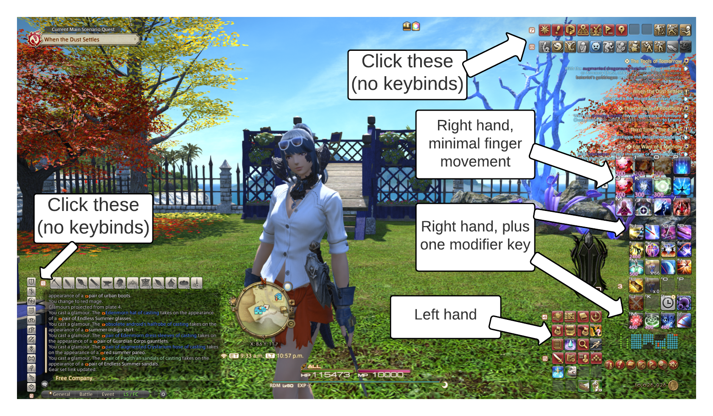
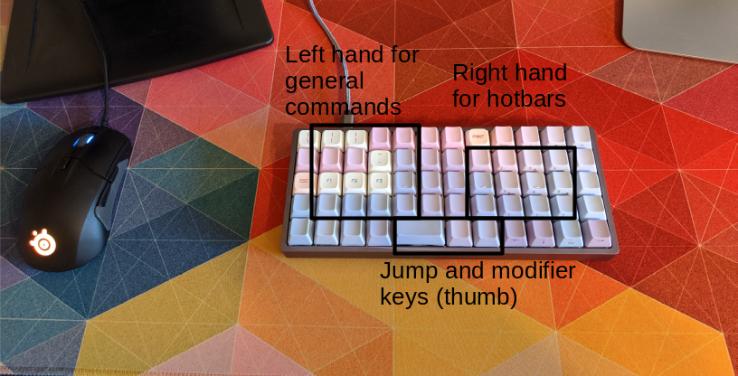
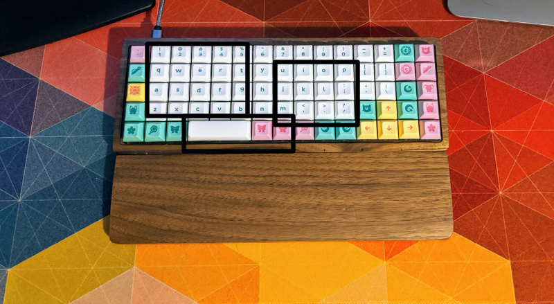
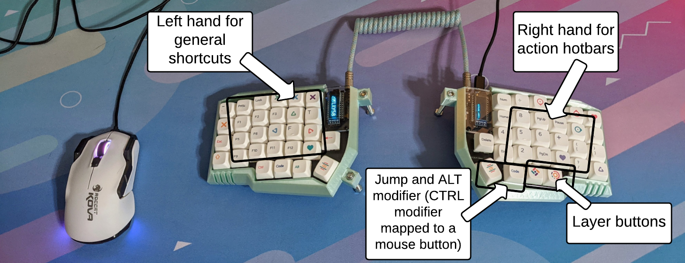
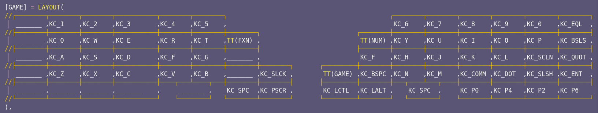

# Using ortho keyboards with FFXIV

## Introduction

Number 1 thing to note about this explainer: I am a left-handed mouse user. Meaning I use the mouse with my left hand. Yes I know it is weird. No I will not consider changing. I've been doing it this way for ~30 years now. I have no interest in trying to retrain my brain and my muscles at this point.

Anyway, the point is that you'll probably want to flip the left/right usage below if you plan to modify any of this for yourself.

## In game HUD

I use 4x3 hotbar layout for my action hotbars that I have mapped to keys on my keyboard. This is on purpose! I have four (non-thumb) fingers on each hand. So the columns of my hotbars directly correspond to which finger I use to push the button. Home row (on the keyboard) corresponds to the middle row (of each hotbar). If you can map your modifier keys to your thumb, you can get access to 3 full hotbars while barely moving any of your fingers.

As a note, the actions I have mapped to my left hand are actually mapped at the action level, not the hotbar level.  For example, my crafting log is mapped to the 1 key. I just have the hotbar displayed because I found it helpful when I was learning the layout. I could definitely hide or delete those hotbars now, or repurpose them for something else, without losing my key maps.

The rest of this page is a guide through my journey to find the perfect Game Layer layout for me on an ortholinear/column stagger keyboard, specifically tailored to my FFXIV experience.

## Attempt 1: Macropad

At first, I tried using a 6x8 ortholinear macropad. It worked fine, but shortly after I started using it, I got into custom mechanical keyboards. I hungered for a usable keyboard for both typing and gaming.

## Attempt 2: Preonic

I knew I liked the ortholinear layout for my hotbars in FFXIV. Once I started using the macropad, and to this day, I didn't/don't think I'll ever want to use a row-staggered board for gaming again.

The Preonic worked out OK for gaming but was too small for me for typing.  In this setup I didn't use a separate gaming layer. I just mapped my hotbars to the alphas and mapped my bottom row to the modifier keys I needed in a place where I could reach them, as shown below.

## Attempt 3: XD75

I moved to a slightly larger ortholinear keyboard next - 75 keys in a 5x15 layout, compared to the Preonic's 5x12 = 60 key layout.

The setup here was exactly the same as the Preonic (no separate gaming layer). The additional keys didn't affect how I used the keyboard for gaming, only for typing.

## Attempt 4: Lily58

I wanted to try a split column stagger board, so I bought a Lily58 kit. It was a really fun build, and it finally motivated me to play more with layers because I was back down in the key count. (If you didn't guess from the name of the keyboard, this one has 58 keys.)

## Attempt 5: Redox (current setup)

Just like the transition from the Preonic (60 keys) to the XD75 (75 keys), I wasn't completely happy with the Lily58 (58 keys) and replaced it with a Redox (72 keys). This is a real sweet spot for me! I have enough thumb cluster and bottom row keys for my needs. I went all-in on layers. These are the layers I was using already with my Lily58:

* Base alpha layer
* Function layer (F keys on left hand, media controls on right hand)
* Numpad layer (eventually got TT to work in QMK so it will stick on numpad when I'm doing calculation work)
* Symbol layers (hold F to type symbols with right hand, hold J to type symbols with left hand). Credit for this idea goes to the user `atinyzubat` from the [Cute Keyboard Club](https://cutekeyboard.club). You can find his layout explainer [here](https://rmwphd.github.io/ergodox).

When I moved to the Redox, I added the following layers:

* Adjust layer (for RGB backlight adjustments, firmware reset)
* Game layer (finally!!!)

My game layer is built pretty specifically for FFXIV. Both of my modifier keys for action hotbars are now easily and comfortably reachable in my thumb cluster. Space and numpad 0/4/2/6 are mapped in the bottom row for easy access to jump, select/OK, and left/right/down arrow navigation in in-game menus. Backspace is above my modifier keys so I don't have to swap out of the game layer while using the chatbox if I make a typo.  Just like with my numpad layer, I have it set up with TT in QMK so that I can turn it on and it will stay in this mode until I turn it off again.

Oh yeah, you might be wondering why there is a random F key mapped above the thumb cluster. I have F mapped to sprint!